# Headcount — Event Feedback Collection Features

A complete inventory of post-event feedback **asking**, **collection**, **reporting**, and **automation** capabilities in the Headcount platform. Feedback is opt-in per event, sent to checked-in attendees after the event ends, and collected through a fixed 4-question star-rating form in the member portal.

---

## Table of Contents

1. [Overview & Workflow](#1-overview--workflow)
2. [Per-Event Configuration](#2-per-event-configuration)
3. [Automated Feedback Request Emails](#3-automated-feedback-request-emails)
4. [Email Templates](#4-email-templates)
5. [Member Portal — Feedback Form](#5-member-portal--feedback-form)
6. [Rating Questions & Data Model](#6-rating-questions--data-model)
7. [Eligibility & Validation Rules](#7-eligibility--validation-rules)
8. [Admin — Event Feedback Tab](#8-admin--event-feedback-tab)
9. [Admin — Feedback Reports](#9-admin--feedback-reports)
10. [APIs](#10-apis)
11. [Background Jobs (Cron)](#11-background-jobs-cron)
12. [Database Schema & Migrations](#12-database-schema--migrations)
13. [Services & Helpers](#13-services--helpers)
14. [Related Documentation](#14-related-documentation)

---

## 1. Overview & Workflow

```mermaid
flowchart LR
    A[Admin enables Collect post-event feedback] --> B[Event published & held]
    B --> C[Members check in at event]
    C --> D[Event ends]
    D --> E[Cron ~24h later]
    E --> F[Feedback request email]
    F --> G[Member opens portal form]
    G --> H[4 star ratings + optional text]
    H --> I[Stored in event_feedback]
    I --> J[Admin views per-event tab & org reports]
```



| Step | What happens |
|------|----------------|
| **Configure** | Admin checks **Collect post-event feedback** when creating or editing an event |
| **Attend** | Only members who **checked in** are eligible to receive a request and submit feedback |
| **Ask** | Daily cron emails checked-in attendees **~1 day after the event ends** (24–48h window) |
| **Collect** | Member completes the portal form (login required); responses can be **updated** later |
| **Review** | Admins/coordinators view stats on the event **Feedback** tab and org **Reports → Feedback** |

Feedback is **not** sent to no-shows, guests without accounts, or members who RSVP’d but did not check in.

---

## 2. Per-Event Configuration

| Feature | Location | Description |
|---------|----------|-------------|
| **Opt-in toggle** | `events.collect_feedback` (migration `070`) | `TINYINT(1)` default `0` — feedback collection disabled unless explicitly enabled |
| **Create event** | `public/admin/event-create.php` (Options step) | Checkbox: **Collect post-event feedback** with helper text explaining the 1-day email |
| **Edit event** | `public/admin/event-edit.php` (Options step) | Same checkbox; persisted on update |
| **Events API** | `public/api/events.php` | Accepts `collect_feedback` on create/update when column exists |
| **Review step** | Event create/edit wizard review | Shows “Collect post-event feedback” in options summary |

### Checkbox copy (admin UI)

> **Collect post-event feedback**  
> Email checked-in attendees one day after the event ends with a short feedback form

When disabled, the event **Feedback** tab in admin shows a message with a link to edit event settings. The portal eligible-events list excludes the event.

---

## 3. Automated Feedback Request Emails

| Feature | Location | Description |
|---------|----------|-------------|
| **Cron script** | `cron/send-event-feedback.php` | Core sender logic |
| **CLI schedule** | `cron/README.md` | Recommended: daily at 9:00 AM — `0 9 * * * php .../send-event-feedback.php` |
| **HTTP cron** | `public/api/cron-event-feedback.php` | `GET ?key=SECRET` |
| **Dispatcher** | `public/api/cron-run.php?job=event-feedback&key=SECRET` | Alternative HTTP entry |

### Send timing

- Targets **published** events with `collect_feedback = 1` and `event_date <= today`
- Computes event end from `event_date` + `end_time` (or `23:59:59` if no end time)
- Sends when end timestamp falls in **24–48 hours ago** (tolerates daily cron drift)

### Recipients

- Distinct **checked-in** users from `attendance` joined to active `users` with non-empty email
- Skips anyone already logged in `email_logs` with `email_type = 'event_feedback'` and `status = 'sent'` for that event

### Deduplication

| Mechanism | Purpose |
|-----------|---------|
| `reminders` row | `reminder_type = 'feedback_1day'`, `status = 'sent'` — one batch per event |
| `email_logs` | Per-recipient dedup so retries do not double-email the same member |

### Email content

- Subject/body from org **`event_feedback`** template (see below), or system default
- Merge field **`{feedback_link}`** → `headcount_event_feedback_portal_url()` → `/portal/feedback.php?event_id={id}`
- Also supports standard fields: `{first_name}`, `{last_name}`, `{event_name}`, `{event_date}`, `{event_time}`, `{event_location}`, `{organization_name}`

### Delivery

- Uses org SMTP config (encrypted API key or fallback global SMTP2GO)
- Bulk send via `EmailService::sendBulk()` with `email_type => 'event_feedback'` for logging

---

## 4. Email Templates

| Feature | Location | Description |
|---------|----------|-------------|
| **Template type** | `email_templates.template_type = 'event_feedback'` | Label: **Event feedback request** |
| **Admin UI** | `public/admin/email-templates.php` | Editable per organization; seeded on first visit |
| **Default subject** | Seeded template | `How was {event_name}?` |
| **Default body** | Seeded template | Thank-you message + **Share Feedback** CTA button linking to `{feedback_link}` |
| **Fallback in cron** | `send-event-feedback.php` | Inline HTML default if no org or system template found |
| **Merge tag** | `EmailService` | `{feedback_link}` substituted per recipient |

Admins customize wording and branding while keeping the `{feedback_link}` placeholder so members land on the correct event form.

---

## 5. Member Portal — Feedback Form

| Feature | Location | Description |
|---------|----------|-------------|
| **Feedback page** | `public/portal/feedback.php` | Authenticated members only (`PortalAuthMiddleware::requireAuth()`) |
| **Eligible events list** | Same page | Loads via API — past attended events with feedback enabled |
| **Deep link** | `feedback.php?event_id={id}` | Used in feedback request emails; shows form for that event |
| **Star ratings UI** | Inline JS on feedback page | 1–5 stars per question; amber highlight on selection |
| **Submit / update** | POST to portal feedback API | Upsert — members can **update** prior responses |
| **Submission source** | `submitted_via` field | `portal` (default) or `email_link` when `?from=email` is present in URL |

### Page sections

1. **Events awaiting your feedback** — list of eligible past events with “Provide feedback” or “Update feedback”
2. **Submit Feedback** (when `event_id` in URL) — event title, 4 rating groups, optional textarea, submit button

### Portal API

| Endpoint | Method | Description |
|----------|--------|-------------|
| `/api/portal/feedback/eligible` | GET | Past checked-in events with `collect_feedback = 1`; includes `has_feedback` flag |
| `/api/portal/feedback/mine?event_id=` | GET | Current member’s existing response for pre-fill |
| `/api/portal/feedback` | POST | Submit or update feedback (CSRF required) |

Portal nav defines `$navUrls['feedback']` in `public/portal/includes/header.php`; members typically arrive via **email link** or direct URL rather than a prominent sidebar item.

---

## 6. Rating Questions & Data Model

Four fixed questions (same keys everywhere — portal, admin API, reports, CSV):

| Key | Label |
|-----|-------|
| `overall` | Overall experience |
| `content` | Quality of content / program |
| `venue` | Venue & organization |
| `recommend` | Likelihood to recommend |

### Stored fields (`event_feedback`)

| Column | Description |
|--------|-------------|
| `rating` | Legacy/overall score (1–5) — mirrors `rating_scores.overall` |
| `rating_scores` | JSON object with keys `overall`, `content`, `venue`, `recommend` (migration `071`) |
| `feedback_text` | Optional free-text comments |
| `submitted_via` | `portal` or `email_link` (migration `071`) |
| `event_id`, `user_id` | Unique pair — one response row per member per event |

---

## 7. Eligibility & Validation Rules

### Who can submit

| Rule | Enforced by |
|------|-------------|
| Must be **logged-in** portal member | `PortalAuthMiddleware` |
| Must have **attendance** record for the event | `headcount_feedback_event_eligible()` |
| Event must have **`collect_feedback = 1`** | Portal API + eligibility query |
| Event must be **in the past** (date before today, or today after `end_time`) | `/feedback/eligible` query |

### Submission validation

- All four rating questions required (**1–5 stars** each)
- `feedback_text` optional
- Invalid or ineligible event returns `400` with error messages
- Legacy API clients may send single `rating` field — mapped to `overall` only

### Who receives the ask email

| Included | Excluded |
|----------|----------|
| Checked-in members with active account + email | No-shows, walk-ins without user account |
| Not already sent `event_feedback` email for that event | Inactive users, empty email |

---

## 8. Admin — Event Feedback Tab

| Feature | Location | Description |
|---------|----------|-------------|
| **Tab** | `public/admin/event-details.php` → **Feedback** | Loads on tab click via `loadEventFeedback()` |
| **API** | `GET public/api/event-feedback.php?event_id=` | JSON stats + all responses |
| **Disabled state** | Tab UI | Message + link to edit event when `collect_feedback` is off |

### Stats cards (when enabled)

| Metric | Calculation |
|--------|-------------|
| **Responses** | `responses / checked_in` |
| **Response rate** | Percent of checked-in attendees who submitted |
| **Avg overall** | Mean of `rating` / `overall` score |

### Detail views

- **Average by question** — bar per question (`overall`, `content`, `venue`, `recommend`)
- **All responses** — table: member name, submitted date, 4 scores, comments
- **Export CSV** — `GET .../event-feedback.php?event_id=&export=csv`  
  Columns: Name, Email, Submitted, Overall, Content, Venue, Recommend, Other feedback

Access: **admin or coordinator** (`AuthMiddleware::requireAdminOrCoordinator()`).

---

## 9. Admin — Feedback Reports

| Feature | Location | Description |
|---------|----------|-------------|
| **Reports tab** | `public/admin/reports.php` → **Feedback** | Org-wide analytics for date-filtered events |
| **Tab template** | `public/admin/includes/reports/tab-feedback.php` | Summary cards, charts, event table |
| **Charts** | `public/js/reports-charts.js` | Bar chart (avg by question), line chart (responses over time) |
| **CSV export** | `public/api/export-report.php?type=feedback` | Summary + per-event breakdown |
| **Service** | `AdminReportService` | `getFeedbackSummaryStats()`, `getFeedbackQuestionAverages()`, `getFeedbackTrend()`, `getFeedbackByEventList()` |

### Org summary metrics

| Metric | Description |
|--------|-------------|
| Total responses | Count in date range |
| Avg overall rating | Mean `rating` across responses |
| Response rate | Responses ÷ checked-in on feedback-enabled events |
| Events with feedback | Distinct events with at least one response |

### Feedback by event table

Lists events with `collect_feedback = 1` in the filter period: title, date, checked-in count, responses, rate %, avg overall, link to event details.

Reports respect the same **date range and event filters** as other report tabs.

---

## 10. APIs

### Admin

| Endpoint | Auth | Description |
|----------|------|-------------|
| `GET /public/api/event-feedback.php?event_id=` | Admin/coordinator | Stats + response list JSON |
| `GET /public/api/event-feedback.php?event_id=&export=csv` | Admin/coordinator | Per-event CSV download |

### Portal (member)

| Endpoint | Auth | Description |
|----------|------|-------------|
| `GET /api/portal/feedback/eligible` | Member session | Eligible past events |
| `GET /api/portal/feedback/mine?event_id=` | Member session | Member’s existing response |
| `POST /api/portal/feedback` | Member session + CSRF | Submit/update feedback |

### Events CRUD

| Field | API |
|-------|-----|
| `collect_feedback` | `public/api/events.php` create/update payloads |

---

## 11. Background Jobs (Cron)

| Job | Script | Schedule | Action |
|-----|--------|----------|--------|
| **Event feedback** | `cron/send-event-feedback.php` | Daily (~9 AM) | Send feedback request emails |
| **HTTP trigger** | `public/api/cron-event-feedback.php` | On demand | Same script via secret key |
| **Unified dispatcher** | `cron-run.php?job=event-feedback` | On demand | Registered dispatcher job |

### Prerequisites for cron to run

- Migration `070` applied (`collect_feedback` column)
- Org email (SMTP) configured, or global SMTP2GO fallback
- At least one checked-in attendee with email for the event

### Logging & observability

- Console output: per-event send counts, total sent/errors
- `email_logs` rows with `email_type = 'event_feedback'`
- `reminders` entry per event batch (`feedback_1day`)

---

## 12. Database Schema & Migrations

| Migration | Change |
|-----------|--------|
| `011_create_event_feedback_table.sql` | Base `event_feedback` table (single `rating` + text) |
| `070_event_feedback_collection.sql` | `events.collect_feedback` toggle |
| `071_event_feedback_rating_scores.sql` | `rating_scores` JSON, `submitted_via` enum |
| `072_reminders_feedback_type.sql` | `reminders.reminder_type` adds `feedback_1day` |
| `073_email_logs_feedback_type.sql` | `email_logs.email_type` adds `event_feedback` |
| `074_event_feedback_columns_repair.sql` | Idempotent repair / full table definition |

### Key tables

```
events.collect_feedback          → opt-in flag
event_feedback                   → one row per (event, user)
attendance                       → eligibility (checked in)
email_templates (event_feedback) → request email content
email_logs (event_feedback)      → per-recipient send tracking
reminders (feedback_1day)        → per-event batch dedup
```

---

## 13. Services & Helpers

| Component | Role |
|-----------|------|
| `headcount_feedback_rating_questions()` | Canonical question keys/labels (`portal/feedback.php` API) |
| `headcount_feedback_event_eligible()` | Validates attendance + `collect_feedback` |
| `headcount_event_feedback_portal_url()` | Builds feedback form URL for emails (`src/helpers.php`) |
| `EmailService::sendBulk()` | Sends feedback requests; substitutes `{feedback_link}` |
| `EmailLog` model | Allows `event_feedback` email type |
| `AdminReportService` | Org-wide feedback analytics for reports tab |
| `EventCalendarService` | Unrelated to feedback — events calendar only |

---

## 14. Related Documentation

- [Event Management Features](./EVENT_MANAGEMENT_FEATURES.md) — check-in, RSVP, communications
- [Email Campaigns & Templates Features](./EMAIL_CAMPAIGNS_AND_TEMPLATES_FEATURES.md) — template editing (if present)
- [Calendar Views Features](./CALENDAR_VIEWS_FEATURES.md) — separate from feedback
- `cron/README.md` — cron URLs and schedules

---

## Feature Summary

| Capability | Supported |
|------------|-----------|
| Per-event opt-in | Yes — `collect_feedback` checkbox |
| Automated email ask | Yes — ~1 day after event end |
| Custom email template | Yes — `event_feedback` type |
| Multi-question ratings | Yes — 4 fixed 1–5 star questions |
| Free-text comments | Yes — optional |
| Checked-in only | Yes — attendance required |
| Portal self-serve list | Yes — eligible past events |
| Update previous response | Yes — upsert per member/event |
| Per-event admin view | Yes — Feedback tab + CSV |
| Org-wide reports | Yes — Reports → Feedback tab + export |
| Guest / anonymous feedback | No — portal login required |
| Program feedback | No — events only |
| Manual “send feedback now” button | No — cron-driven only |
