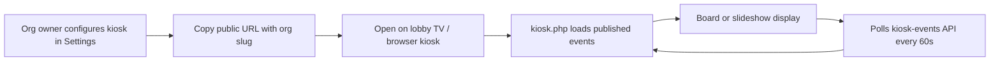

# Headcount — Kiosk / Digital Signage Features

A complete inventory of kiosk and digital signage capabilities in the Headcount platform. The kiosk is a **public, no-login** full-screen display of upcoming **published events**, designed for lobby TVs and unattended screens. Organization owners configure it in admin Settings; the display is addressed by the org’s public slug.

---

## Table of Contents

1. [Overview & Use Case](#1-overview--use-case)
2. [Public Display Page](#2-public-display-page)
3. [Display Modes & Layouts](#3-display-modes--layouts)
4. [Live Data & Self-Healing](#4-live-data--self-healing)
5. [Keyboard Controls](#5-keyboard-controls)
6. [Admin Configuration](#6-admin-configuration)
7. [Kiosk Events API](#7-kiosk-events-api)
8. [Branding & Visual Design](#8-branding--visual-design)
9. [Event Data & Filtering](#9-event-data--filtering)
10. [Security & Privacy](#10-security--privacy)
11. [URL Reference](#11-url-reference)
12. [Database Schema & Migrations](#12-database-schema--migrations)
13. [Shared Helpers](#13-shared-helpers)
14. [Related Documentation](#14-related-documentation)

---

## 1. Overview & Use Case



| Aspect | Detail |
|--------|--------|
| **Purpose** | Show upcoming events on a wall-mounted or lobby screen without staff interaction |
| **Authentication** | None — fully public |
| **Scope** | One organization per URL (`?org=<slug>`) |
| **Content** | **Published events only** in a forward date window (default 7 days) |
| **Programs / facilities** | Not shown on kiosk (events only) |

---

## 2. Public Display Page

| Feature | Location | Description |
|---------|----------|-------------|
| **Kiosk page** | `public/portal/kiosk.php` | Full-screen HTML display; no portal login |
| **Portal routing** | `public/portal/index.php` | `kiosk` listed as a public route (no auth) |
| **Data helpers** | `public/portal/includes/kiosk-data.php` | Shared org lookup, settings, event loading, banner URLs |

### Page structure

| Section | Content |
|---------|---------|
| **Header** | Org logo (or initial letter badge), org name, “Upcoming Events” label, live clock + date |
| **Main** | Board grid or slideshow (JS-rendered; `<noscript>` fallback grid for first paint) |
| **Footer** | Event count, “next N days” label, last-updated timestamp |

### Error states

| Condition | HTTP | User sees |
|-----------|------|-----------|
| Missing/invalid org slug | 404 | “Display not found” + example `?org=your-org` |
| Kiosk disabled in settings | 403 | Org name + “The events display is currently turned off.” |
| Config / DB failure | 500 | Generic error message |

---

## 3. Display Modes & Layouts

Two layouts, configurable as the org default or overridden via URL.

### Board mode (`mode=board`)

| Feature | Description |
|---------|-------------|
| **Layout** | Responsive card grid — 2 columns (default), 3 columns when more than 6 events |
| **Card content** | Date badge (month/day/weekday), “Today/Tomorrow/weekday · time” pill, title, location |
| **Banner** | Optional faded event banner image as card background |
| **Empty state** | Calendar icon + “No upcoming events this week” |

### Slideshow mode (`mode=slideshow`)

| Feature | Description |
|---------|-------------|
| **Layout** | Single centered event, large typography |
| **Content** | Day label pill, title (5xl–7xl), date + time, location |
| **Progress** | Dot indicators along bottom; active slide elongated |
| **Auto-advance** | Rotates every `interval` seconds (default 8, min 3, max 60) when 2+ events |
| **Manual toggle** | Press **M** to switch to/from board mode at runtime |

### URL overrides

Saved org defaults can be overridden per display session:

| Param | Values | Default (from org) |
|-------|--------|---------------------|
| `mode` | `board`, `slideshow` | `kiosk_mode` |
| `days` | 1–60 | `kiosk_days` (7) |
| `interval` | 3–60 (seconds) | `kiosk_interval` (8) |

Example: `/portal/kiosk.php?org=masjid-demo&mode=slideshow&days=14&interval=12`

---

## 4. Live Data & Self-Healing

Designed for unattended 24/7 lobby screens.

| Behavior | Interval | Description |
|----------|----------|-------------|
| **Live clock** | Every 15 seconds | Header time/date in org timezone via `Intl.DateTimeFormat` |
| **API poll** | Every 60 seconds | Fetches fresh events from `kiosk-events.php`; keeps last good data on error |
| **Full page reload** | Every 60 minutes | Self-heal for memory leaks or stale browser state |
| **Offline tolerance** | On fetch failure | Continues showing cached event list (no blank screen) |

Poll URL includes cache-buster `&_=<timestamp>`. Footer shows “Updated HH:MM” after successful refresh.

---

## 5. Keyboard Controls

Hidden operator shortcuts (documented in admin Settings UI):

| Key | Action |
|-----|--------|
| **M** | Toggle board ↔ slideshow |
| **F** | Enter / exit browser fullscreen |

Useful when configuring a TV browser or tablet in kiosk mode without a mouse.

---

## 6. Admin Configuration

| Feature | Location | Description |
|---------|----------|-------------|
| **Settings tab** | `public/admin/settings.php` → **Kiosk Display** | Visible to **organization owner (super-admin) only** |
| **Save API** | `POST public/api/settings.php?action=update_kiosk` | Persists org kiosk columns |
| **Access control** | `AuthMiddleware::isSuperAdmin()` | Regular admins/coordinators cannot change kiosk settings |

### Settings UI features

| Control | Field | Description |
|---------|-------|-------------|
| **Live / Off badge** | Reflects `kiosk_enabled` | Visual status in tab header |
| **Public display link** | Read-only URL | `https://…/portal/kiosk.php?org={slug}` with Copy button |
| **Preview links** | Open board / Open slideshow | Opens kiosk in new tab with `&mode=` override |
| **Enable toggle** | `kiosk_enabled` | Master on/off for public display and API |
| **Default layout** | `kiosk_mode` | Board (grid) or Slideshow |
| **Days ahead** | `kiosk_days` | 1–60 days forward window |
| **Slideshow seconds** | `kiosk_interval` | 3–60; disabled in UI when mode is board |

### Prerequisites

- Organization must have a **slug** set — otherwise the UI warns that no public URL can be generated
- Migration **069** must be applied (`kiosk_*` columns on `organizations`)

### API payload (`update_kiosk`)

```json
{
  "enabled": 1,
  "mode": "board",
  "days": 7,
  "interval": 8
}
```

Response includes saved `kiosk` object; org settings cache is invalidated on save.

---

## 7. Kiosk Events API

| Feature | Location | Description |
|---------|----------|-------------|
| **Feed endpoint** | `GET public/api/portal/kiosk-events.php` | JSON poll endpoint for live refresh |
| **Auth** | None | Public, read-only |
| **Cache headers** | `Cache-Control: no-store, max-age=0` | Always fresh when polled |

### Query parameters

| Param | Required | Description |
|-------|----------|-------------|
| `org` | Yes | Organization slug |
| `days` | No | Forward window (default 7, clamped 1–60) |

### Response (success)

```json
{
  "success": true,
  "org": { "name", "slug", "primary_color", "timezone" },
  "days": 7,
  "count": 3,
  "events": [ /* normalized event objects */ ],
  "server_now": "ISO-8601 in org timezone"
}
```

### Response (errors)

| Code | Condition |
|------|-----------|
| 404 | Unknown slug |
| 403 | `kiosk_enabled = 0` (`disabled: true` in JSON) |
| 500 | Server error |

Uses the same `headcount_kiosk_load_events()` helper as the page’s server-side initial render.

---

## 8. Branding & Visual Design

| Element | Source | Usage |
|---------|--------|-------|
| **Primary color** | `organizations.primary_color` | CSS `--accent`; buttons, date badges, gradients (fallback `#465fff`) |
| **Logo** | `organizations.logo_path` | Header image via image API; fallback = first letter of org name |
| **Timezone** | `organizations.timezone` | Clock, date labels, event window boundaries (fallback `America/New_York`) |
| **Font** | Outfit (with system fallbacks) | Matches admin portal typography |
| **Background** | Radial gradients | Subtle accent-tinted light background |

Event **banner images** load through `headcount_kiosk_banner_url()` → `/api/image.php?path=…` (same approach as portal events API).

---

## 9. Event Data & Filtering

### Inclusion rules

| Rule | Implementation |
|------|----------------|
| Status | `published` only |
| Date range | `event_date` from **today** through **today + N days** (org timezone) |
| Organization | Scoped to org resolved from slug |
| Sort | `event_date ASC`, `start_time ASC` |

Draft, scheduled, and cancelled events are never shown.

### Fields loaded from database

`id`, `title`, `event_date`, `start_time`, `end_time`, `location`, `category`, `capacity`, `banner_image`

### Normalized display payload (per event)

| Field | Example | Shown on screen |
|-------|---------|-----------------|
| `title` | Community Iftar | Yes |
| `location` | Main hall | Yes (with map pin icon) |
| `day_label` | Today / Tomorrow / Friday | Yes |
| `time_pretty` | 7:30 PM / All day | Yes |
| `date_pretty` | Fri, Jun 20 | Slideshow |
| `day_num`, `month_short`, `weekday_short` | 20, JUN, FRI | Board date badge |
| `banner_url` | Absolute image URL | Optional card background |
| `category`, `capacity` | — | Loaded but **not rendered** on kiosk UI |

### Day labels

Computed in org timezone:

- Same calendar date as today → **Today**
- Tomorrow’s date → **Tomorrow**
- Otherwise → full weekday name (e.g. **Friday**)

Events without `start_time` display as **All day**.

---

## 10. Security & Privacy

| Topic | Behavior |
|-------|----------|
| **Authentication** | Not required; intentional for public signage |
| **Identification** | Org identified by public **slug** only (not secret) |
| **Data exposed** | Published event titles, dates, times, locations, banners — no RSVP counts, no member PII |
| **Disable switch** | Owner can turn off display instantly (`kiosk_enabled = 0`) — page and API return 403 |
| **Write access** | None — kiosk and feed are read-only |
| **Settings changes** | Super-admin (org owner) only |

Anyone with the kiosk URL can view the org’s upcoming published events while the display is enabled. Treat the slug as a low-sensitivity public identifier (similar to a public events page).

---

## 11. URL Reference

### Primary display URL

```
/portal/kiosk.php?org=<organization-slug>
```

### With overrides

```
/portal/kiosk.php?org=<slug>&mode=slideshow&days=14&interval=10
```

### API feed

```
/api/portal/kiosk-events.php?org=<slug>&days=7
```

Path prefix may include project folder (e.g. `/Headcount/public/portal/kiosk.php`) depending on deployment; admin Settings builds the correct absolute URL from the current host.

---

## 12. Database Schema & Migrations

| Migration | Change |
|-----------|--------|
| `069_add_kiosk_settings.sql` | Adds kiosk columns to `organizations` |

### `organizations` kiosk columns

| Column | Type | Default | Description |
|--------|------|---------|-------------|
| `kiosk_enabled` | TINYINT(1) | 1 | Master on/off |
| `kiosk_mode` | VARCHAR(20) | `board` | `board` or `slideshow` |
| `kiosk_days` | INT UNSIGNED | 7 | Forward days to show |
| `kiosk_interval` | INT UNSIGNED | 8 | Slideshow seconds per slide |

Also reflected in `database/schema.sql`.

---

## 13. Shared Helpers

All in `public/portal/includes/kiosk-data.php`:

| Function | Purpose |
|----------|---------|
| `headcount_kiosk_org_by_slug()` | Resolve org by slug; returns display-safe subset (no SMTP/secrets) |
| `headcount_kiosk_settings()` | Read kiosk columns with defaults; graceful if migration 069 missing |
| `headcount_kiosk_banner_url()` | Build absolute banner URL via `image.php` |
| `headcount_kiosk_load_events()` | Query + normalize published events for signage |

Used by both `kiosk.php` (SSR initial payload + noscript) and `kiosk-events.php` (JSON poll).

---

## 14. Related Documentation

- [Event Management Features](./EVENT_MANAGEMENT_FEATURES.md) — event publish status, banners, locations
- [Calendar Views Features](./CALENDAR_VIEWS_FEATURES.md) — admin/public calendar views (separate from kiosk)
- [Feedback Collection Features](./FEEDBACK_COLLECTION_FEATURES.md) — post-event surveys (not kiosk-related)

---

## Feature Summary

| Capability | Supported |
|------------|-----------|
| Public no-login display | Yes |
| Board (grid) layout | Yes |
| Slideshow layout | Yes |
| Live clock (org timezone) | Yes |
| Auto-refresh from API | Yes (60s) |
| Fullscreen keyboard shortcut | Yes (**F**) |
| Layout toggle at runtime | Yes (**M**) |
| Org logo + brand color | Yes |
| Event banner images | Yes |
| Enable/disable from admin | Yes |
| URL param overrides | Yes (`mode`, `days`, `interval`) |
| Programs on kiosk | No |
| Facility bookings on kiosk | No |
| RSVP / attendance counts | No |
| Check-in from kiosk | No |
| Per-event kiosk visibility | No (published + date window only) |
| Multi-org single screen | No (one slug per URL) |
