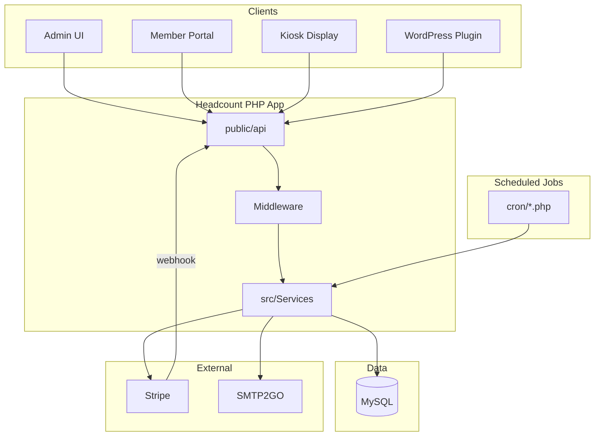

# Headcount Platform — Complete Feature Reference

Headcount is a **self-hosted community events and attendance management platform**. It gives organizations one place to run events, track who attended, communicate with members, collect payments, manage programs and classes, and handle facility bookings.

This document is a single, end-to-end reference for everything the platform does — who it is for, how it is built, and every major feature across the admin area, member portal, APIs, background jobs, and integrations.

---

## Table of Contents

1. [Platform Overview](#1-platform-overview)
2. [Target Users & Roles](#2-target-users--roles)
3. [Technology Stack](#3-technology-stack)
4. [Architecture & Directory Layout](#4-architecture--directory-layout)
5. [Admin Area](#5-admin-area)
6. [Member Portal](#6-member-portal)
7. [Event Management](#7-event-management)
8. [Program Management](#8-program-management)
9. [Facility Management](#9-facility-management)
10. [Member & Family Management](#10-member--family-management)
11. [Check-In & Attendance](#11-check-in--attendance)
12. [Payments, Refunds & Transfers](#12-payments-refunds--transfers)
13. [Email Communications](#13-email-communications)
14. [Reporting & Analytics](#14-reporting--analytics)
15. [Kiosk & Digital Signage](#15-kiosk--digital-signage)
16. [Event Feedback Collection](#16-event-feedback-collection)
17. [Calendar Views](#17-calendar-views)
18. [Public APIs & WordPress Plugin](#18-public-apis--wordpress-plugin)
19. [Background Jobs (Cron)](#19-background-jobs-cron)
20. [Security](#20-security)
21. [Installation & Deployment](#21-installation--deployment)
22. [Related Documentation](#22-related-documentation)

---

## 1. Platform Overview

### What Headcount Does

Headcount helps community organizations:

- **Create and publish events** — one-off or recurring, free or paid, in-person or virtual
- **Collect RSVPs** — from logged-in members, guests, and household/family members
- **Check people in quickly** — search, QR code scan, family check-in, and offline mode
- **Manage a member database** — profiles, tags, groups, families, and CSV import
- **Send email** — transactional confirmations, automated reminders, marketing campaigns, and bulk mail
- **Process payments** — Stripe checkout for events, programs, and facility bookings
- **Run programs** — ongoing classes with sessions, enrollment, attendance, and coupons
- **Book facilities** — room/space reservations with approval workflows and optional payment holds
- **Report and export** — attendance, revenue, members, programs, facilities, and feedback
- **Display events publicly** — kiosk lobby screens, WordPress embeds, and public API feeds

### Who It Is For

Headcount is designed for:

- Religious organizations (churches, mosques, temples, synagogues)
- Community centers and nonprofits
- Social clubs and associations
- Educational groups and classes

Organizations self-host Headcount on their own server or hosting provider. It can run in a subdirectory or subdomain alongside an existing website.

---

## 2. Target Users & Roles

### Role Summary

| Role | Who | Access |
|------|-----|--------|
| **Super admin** | Organization owner (`users.is_super_admin`) | Full access; cannot be locked out by permission overrides |
| **Admin** | Staff with `role = admin` | Full admin area by default; granular permissions can be customized |
| **Coordinator** | Staff with `role = coordinator` | Limited admin — typically check-in and refunds; scoped facilities/programs |
| **Member** | Community participants (`role = member`) | Member portal only: RSVP, profile, QR, payments, family |
| **Guest** | Unauthenticated visitors | Guest RSVP, guest facility booking, guest program registration |
| **Public / kiosk** | Lobby displays, external websites | Kiosk display, public APIs, WordPress embeds (no login) |

### Granular Permissions

Beyond roles, Headcount supports per-role and per-user permission overrides. Resolution order:

1. Super admin → always allowed
2. Per-user override (`user_permissions`)
3. Per-role override (`role_permissions`)
4. Role default

| Capability | Description | Admin default | Coordinator default |
|------------|-------------|---------------|---------------------|
| `events.manage` | Create, edit, delete events | Yes | No |
| `checkin.run` | Run event check-in | Yes | Yes |
| `attendance.correct` | Correct attendance after events | Yes | No |
| `members.manage` | Manage members and families | Yes | No |
| `members.import` | Import members via CSV | Yes | No |
| `refunds.process` | Process refunds and refund requests | Yes | Yes |
| `payments.manage` | View and manage payments / transfers | Yes | No |
| `programs.manage` | Manage programs | Yes | No |
| `facilities.manage` | Manage facilities and bookings | Yes | No |
| `campaigns.send` | Send email campaigns and templates | Yes | No |
| `reports.view` | View reports | Yes | No |
| `settings.access` | Access organization settings | Yes | No |

---

## 3. Technology Stack

| Layer | Technology |
|-------|------------|
| **Runtime** | PHP 8.0+ (Composer platform: 8.2.12) |
| **Database** | MySQL 5.7+ / MariaDB 10.3+ |
| **Web server** | Apache with `mod_rewrite` |
| **Architecture** | MVC + Service layer; file-based PHP routing |
| **Dependencies** | `stripe/stripe-php`, `endroid/qr-code`, `dompdf/dompdf` |
| **Frontend** | Tailwind CSS, Alpine.js, FullCalendar 6.1.15, Quill (rich text), GrapesJS (campaigns) |
| **PWA** | Service worker (`sw.js`) and manifest for offline check-in |
| **Email** | SMTP2GO API |
| **Payments** | Stripe Checkout + webhooks |
| **PDF** | Dompdf (report exports) |
| **WordPress** | Separate plugin at `headcount-wordpress-plugin/` |

Configuration lives in `config/config.php` (copied from `config/config-sample.php`): database credentials, app URL, Stripe keys, SMTP2GO API key, encryption key, cron secrets, upload limits, and logging settings.

---

## 4. Architecture & Directory Layout

```
Headcount/
├── public/                    # Web root
│   ├── admin/                 # Admin UI (router: index.php?page=...)
│   ├── api/                   # JSON API endpoints
│   ├── portal/                # Member portal (router: index.php)
│   ├── cron/                  # HTTP-accessible cron scripts
│   ├── css/, js/, assets/     # Static assets
│   ├── manifest.json, sw.js   # PWA
│   └── unsubscribe.php        # Email unsubscribe handler
├── src/                       # Application code (PSR-4: Headcount\)
│   ├── Controllers/           # Request handlers
│   ├── Models/                # Data models
│   ├── Services/              # Business logic (~40 services)
│   ├── Middleware/            # Auth, PortalAuth, Admin, CSRF
│   ├── Integrations/          # StripeService, SMTP2GOService
│   ├── Core/                  # Database, Cache, Logger, Security
│   └── Helpers/               # Auth, Permissions, Security, Validator
├── database/
│   ├── schema.sql             # Base schema
│   └── migrations/            # Incremental SQL migrations
├── cron/                      # CLI scheduled jobs
├── config/                    # Application configuration
├── templates/                 # HTML email templates
├── install/                   # Installation wizard
├── scripts/                   # Maintenance scripts (Stripe reconcile, backups)
├── headcount-wordpress-plugin/ # WordPress embed plugin
├── docs/                      # Documentation
├── tests/                     # PHPUnit tests
├── logs/, uploads/            # Runtime data
└── vendor/                    # Composer packages
```

### Routing

- **Admin:** `public/admin/index.php?page={page}` → `public/admin/{page}.php`
- **Portal:** `public/portal/index.php` → path segments → `public/portal/{page}.php`
- **API:** Standalone `public/api/*.php` files (primary) plus legacy `public/api/index.php` REST router

### High-Level Architecture



---

## 5. Admin Area

The admin area is accessed at `/admin/`. Staff log in with email and password (optional 30-day "Remember me"). Pages are permission-gated based on role and granular capabilities.

### Admin Navigation Groups

**Menu**
- Dashboard
- Events (list + calendar)
- Programs (list + attendance)
- Facilities (list + bookings)
- Members
- Check-In

**Reports & Finance**
- Reports
- Payment Transfers
- Refund Requests

**System**
- Notifications
- Activity Log
- Email Templates
- Email & Campaigns
- Settings

### Complete Admin Page Reference

| Page | Purpose |
|------|---------|
| **Dashboard** | KPIs: upcoming events, member count, MTD attendance, total events; quick actions |
| **Events list** | Filter, search, series collapsing, bulk actions, link to calendar |
| **Events calendar** | FullCalendar month/week/day; click event for side panel; click date to create |
| **Create event** | 6-step wizard: Basics → Schedule → Registration → Options → Questions → Review |
| **Edit event** | 5-step wizard for updates |
| **Event details** | Per-event hub: RSVPs, email actions, invites, feedback, stats |
| **Programs list** | Card/table views, category filter, links to details/edit/attendance |
| **Program edit** | 3-step wizard: Basic Info → Schedule & Pricing → Questions & Save |
| **Program details** | Overview, registrants, sessions & attendance, share/QR |
| **Program attendance** | Session picker → mark Present/Absent/Excused |
| **Facilities list** | Grid/list toggle, search, status filter |
| **Facility edit** | 4-step wizard: Basic Info → Images & Pricing → Availability → Booking Rules |
| **Facility details** | Calendar, booking history, schedule blocks, managers |
| **Facility bookings** | Booking queue: approve, reject, cancel |
| **Facility bookings calendar** | Org-wide FullCalendar across all facilities |
| **Members** | Search, tags, groups, bulk email |
| **Member add / edit** | Create or update member profiles |
| **Member details** | Profile, family, RSVPs, payments, activity |
| **Member import** | CSV import with column mapping |
| **Check-in** | Event check-in: search, QR scan, offline mode |
| **Reports** | Multi-tab analytics (see Reporting section) |
| **Payment transfers** | Stripe sync, transfers, pending reconciliation |
| **Refund requests** | Member-initiated refund queue |
| **Notifications** | In-app admin notifications |
| **Activity log** | Audit trail of admin actions |
| **Email templates** | Quill WYSIWYG template library |
| **Email & campaigns** | GrapesJS campaign composer, automation, delivery logs |
| **Settings** | Org profile, Stripe, email, team, permissions, kiosk, API key, waiver |
| **Profile** | Admin user profile |
| **Health** | System health check |
| **Login / forgot / reset password** | Authentication flows |

---

## 6. Member Portal

The member portal is accessed at `/portal/`. Members can register, log in with password or magic link, and manage their community participation.

### Authentication

- **Password login** with optional 30-day remember-me
- **Magic link** — passwordless email link login
- **Self-registration** with email verification
- **Forgot / reset password** flows

### Portal Pages

| Page | Auth required | Purpose |
|------|---------------|---------|
| **Dashboard** | Yes | Home, stats, upcoming events |
| **Events** | No | Browse published events |
| **Event details** | No | RSVP, tickets, potluck, questions, family RSVP |
| **My RSVPs** | Yes | RSVP history with filters |
| **Programs** | No | Browse published programs |
| **Program details** | No | View program info; register when logged in |
| **My programs** | Yes | Enrolled programs |
| **Guest program register** | No | Guest registration without account |
| **Facilities** | No | Browse bookable facilities |
| **Facility details** | No | View facility info and book |
| **Facility book** | Yes | Member facility booking form |
| **Facility book (guest)** | No | Guest facility booking |
| **My facility bookings** | Yes | Booking history |
| **Family** | Yes | Household/family management |
| **Profile** | Yes | Profile, photo, communication preferences |
| **QR code** | Yes | Personal QR for check-in (refreshes every 24 hours) |
| **Payments** | Yes | Payment history and receipts |
| **Payment success / cancel** | — | Stripe return URLs |
| **Feedback** | Yes | Post-event feedback form |
| **Event attendees** | Varies | Social attendee list |
| **Kiosk** | No | Public lobby digital signage |
| **Login / register / verify** | No | Authentication |

### Member Portal Capabilities

- RSVP for events (free and paid via Stripe)
- RSVP on behalf of family/household members
- Answer custom registration questions
- Accept liability waivers
- Sign up for potluck items
- Select ticket types and tier pricing
- View and cancel RSVPs
- Register for programs (free or paid)
- Book facilities (free or paid with approval workflow)
- Manage family members and relationships
- View payment history and download receipts
- Submit post-event feedback
- Download calendar ICS files
- Set communication preferences (reminders, announcements)

---

## 7. Event Management

Events are the core of Headcount. The platform supports simple gatherings through complex multi-session series with ticketing, eligibility rules, and payment.

### Event Lifecycle

| Status | Meaning |
|--------|---------|
| **Draft** | Not visible to members |
| **Published** | Visible and open for RSVPs |
| **Cancelled** | Event cancelled |
| **Completed** | Event finished |

### Event Creation & Configuration

**Core fields:** title, description, date/time, location, capacity, category, banner image

**Advanced configuration:**
- **Virtual events** — online event flag with virtual details
- **Facility linkage** — link event to an org facility
- **Event people** — speakers and organizers with title and photo
- **Prayer-based scheduling** — start time relative to prayer (e.g., after Maghrib + offset) using org city/country
- **Check-in window** — restrict when check-in is allowed
- **Registration modes** — registration required, deadline, walk-ins allowed when registration closed
- **Extra details** — rich-text additional information

### Recurring Events & Series

- **Recurrence patterns:** daily, weekly, monthly, yearly, custom
- **Monthly weekday recurrence** — e.g., "2nd Tuesday of each month"
- **Custom session dates** — non-standard schedules via JSON
- **Cron generation** — scheduled creation of upcoming instances
- **Session registration modes:**
  - `independent` — RSVP per session
  - `choose_one` — pick one session from series
  - `all_sessions` — one RSVP covers the whole series

### RSVP & Registration

**Member RSVP:**
- Create, update, and cancel RSVPs
- Capacity checks and duplicate email validation
- RSVP confirmation emails (resend available from admin)
- Export RSVPs to CSV with questions, potluck, and family data

**Guest RSVP (no login):**
- `allow_guest_rsvp` flag on events
- Creates guest user + RSVP in one step
- Paid guest checkout via Stripe without portal login
- Bring additional guests (`allow_bring_guests` + guest count)

**Family / household RSVP:**
- Link family members to a parent's RSVP
- Per-family-member check-in under parent account
- Household management in portal Family page

### Custom Registration Questions

- Question types: text, short text, checkbox, number
- Conditional questions (show-if logic based on prior answers)
- Drag/sort question builder in event wizard
- Answers included in exports and admin RSVP views

### Eligibility, Restrictions & Waivers

- Age restrictions (`min_age`, `max_age`)
- Gender restrictions
- Enforcement at RSVP and/or check-in
- Organization-level RSVP waiver (checkbox label + full text)
- Waiver acceptance timestamp stored on RSVPs

### Visibility & Invites

| Mode | Who can see / RSVP |
|------|-------------------|
| `public` | Everyone |
| `internal` | Logged-in members only |
| `invite_only` | Invited members only |

- Per-user invite list for invite-only events
- Invite guests by email
- Admin invite management tab on event details

### Potluck / Food Signup

- Enable potluck per event with allowed category slugs
- RSVP fields: category, item note, quantity, serving side, party size
- Public display of who is bringing what on event details page

### Ticketing & Pricing

| Model | Description |
|-------|-------------|
| **Flat price** | Single `ticket_price` per event |
| **Multiple ticket types** | Named types (Early bird, VIP) with price, quantity limit, sort order |
| **Sale windows** | `sale_starts_at` / `sale_ends_at` per ticket type |
| **Package groups** | Mutually exclusive ticket tiers |
| **Headcount tier pricing** | Bundle pricing by party size (JSON tiers) |

Portal shows sale countdowns, "from $X" pricing, and ticket selection UI.

### Event Communications

- **Announce** — send announcement email to RSVPs
- **Remind** — manual reminder to RSVPs
- **Resend confirmations** — bulk resend RSVP confirmation emails
- **Automated reminders** — 1-week, 1-day, 2-hour (configurable in Email Center)
- **Post-event follow-up** — thank-you emails via cron
- **Schedule change notifications** — email when event details change

### Event Reporting & Exports

- Per-event RSVP list with question answers, potluck, payments
- RSVP export (CSV)
- Check-in export (CSV)
- Event feedback tab (when enabled)
- Included in org-wide Reports

---

## 8. Program Management

Programs are ongoing classes, courses, or halaqahs with recurring sessions, member enrollment, attendance tracking, and optional payments.

### Program Lifecycle

| Status | Meaning |
|--------|---------|
| **Draft** | Not visible |
| **Published** | Open for enrollment |
| **Cancelled** | Program cancelled |
| **Archived** | Soft-deleted; hidden from default lists |

### Program Configuration

- Title, WYSIWYG description, location, banner image
- Virtual program flag
- Category assignment
- Capacity (counts active + pending registrations)
- `show_on_public_site` flag for public API and WordPress embed
- Presenters (display name, title, image) shown on portal

### Scheduling & Sessions

- **Recurrence:** weekly, bi-weekly, monthly, or none
- **Fixed clock times** or **prayer-based** start/end times
- **Daily break window** — optional break copied to each session
- **Program weeks** — admin-defined enrollment units with title, price, capacity, and session dates
- **Registration modes:**
  - `whole_program` — enroll in full program
  - `select_weeks` — enroll in chosen weeks only
- **Bundle pricing** — discount when all weeks selected
- **Session generation** — cron/API creates `program_sessions` rows ahead of schedule

### Enrollment & Registration

- **Member-only** by default; guest registration available when enabled
- **Free registration** — immediate active status
- **Paid registration** — pending → Stripe checkout → active
- **Enrollment window** — `enrollment_starts_at` / `enrollment_ends_at`
- **Custom registration questions** — text, number, checkbox, radio, dropdown, multi-checkbox
- **Liability waiver** — shared org waiver settings
- **Coupons** — discount codes with usage limits

### Program Attendance

- Dedicated attendance page per program
- Session picker → mark Present / Absent / Excused for active registrants
- Session attendance stored per registration

### Program Communications

- **Announce** — send email to registrants (staff with program assignment can send)
- **Program reminders** — cron sends session reminders

### Program Portal Experience

- Browse and view program details
- Register (free or paid)
- My Programs page with status badges and next session
- Guest registration without portal login

---

## 9. Facility Management

Facilities are bookable rooms and spaces with configurable rules, approval workflows, and optional Stripe payment holds.

### Facility Configuration

**Basic info:** name, slug, description (Quill rich text), location, capacity, status (active/inactive)

**Images & pricing:**
- Multi-image gallery
- Paid facility toggle with hourly rate, discount percent, and label

**Availability:**
- Weekly operating hours (per-day open/close with presets)
- Date-specific blocked times (with member/guest block flags)
- Published Headcount events block member/guest bookings on linked facilities

**Booking rules:**
- Member booking: allowed flag, max duration, advance booking days
- Guest booking: allowed flag, max duration, advance booking days
- Staff booking: max duration, advance days; staff bypasses operating hours and manual blocks
- Duration constraints: min duration, buffer between bookings, slot increment

**Facility managers:** assign admins/coordinators per facility for notifications and approval scope

### Booking Workflow

```
Request (member / guest / staff)
  → Validate rules + overlap + blocks
  → If paid: Stripe authorize hold (pending)
  → Else: pending booking
  → Email requester + facility managers/admins
  → Staff approve → capture payment (if authorized) → approved
  → Staff reject/cancel → release hold → rejected/cancelled
  → 7-day cron → auto-cancel expired authorized holds
```

| Status | Meaning |
|--------|---------|
| **Pending** | Awaiting staff approval |
| **Approved** | Confirmed booking |
| **Rejected** | Declined by staff |
| **Cancelled** | Cancelled by member or staff |

### Portal Booking Experience

- Browse facilities with pricing, capacity, and location
- Facility detail page with image carousel and operating hours
- Live slot availability check and price estimate
- Free bookings → immediate pending request
- Paid bookings → Stripe checkout → pending request with payment hold
- My Facility Bookings — history and cancel pending

### Guest Booking

- No login required
- Guest contact fields + booking form
- Find or create member user record for guest contact
- Guest confirmation emails with account upsell links

### Admin Facility Tools

- Facility details hub: calendar, booking history, schedule blocks, managers
- Org-wide facility bookings calendar (FullCalendar)
- Booking queue with approve/reject/cancel actions
- Staff can create bookings on behalf of users

---

## 10. Member & Family Management

### Member Profiles

- First name, last name, email, phone, gender, date of birth
- Profile photo upload
- Tags and group membership
- Role assignment (member, coordinator, admin)
- Portal credentials generation
- Communication preferences

### Member Organization

| Feature | Description |
|---------|-------------|
| **Tags** | Flexible labels for filtering and segmentation |
| **Groups** | Named member segments for campaigns and bulk email |
| **Families** | Household records linked via relationships |
| **Relationships** | Parent, child, spouse, sibling, and other relationship types |

### Member Import

- CSV upload with column mapping
- Review and confirm before import
- Duplicate detection

### Bulk Email

- Select members from list
- Pick template, edit subject/body
- Send to selected members

### Member Detail Page

Admin view of a single member:
- Profile and contact info
- Family relationships
- RSVP history
- Payment history
- Activity and attendance

---

## 11. Check-In & Attendance

Check-in is designed for speed at the door — search, scan, or offline.

### Check-In Methods

| Method | How it works |
|--------|--------------|
| **Search** | Type name, email, or phone → click to check in |
| **QR code** | Scan member's portal QR code with camera |
| **Family** | When scanning parent QR, option to check in family members too |
| **RSVP list** | Check in directly from RSVP attendee list |
| **Walk-in** | Check in without prior RSVP when event allows walk-ins |
| **Override** | Override check-in restrictions (eligibility, window) with permission |

### Check-In Features

- Real-time attendance count
- Check-in window enforcement (start/end times)
- Eligibility enforcement (age/gender) when configured
- Undo check-in
- Attendance corrections (post-event, permission-gated)
- Cash payment recording at check-in
- Export check-ins to CSV

### Offline Check-In

- Progressive Web App (PWA) with service worker
- Check in without network connection
- Sync when connection restored via `checkin-sync` API
- Offline fallback page in portal

### QR Codes

- Each member has a unique QR code in the portal
- QR codes expire after 24 hours for security
- QR validation API for check-in stations
- Event and program share QR codes for promotion

---

## 12. Payments, Refunds & Transfers

### Stripe Integration

Headcount uses Stripe Checkout for all online payments:

| Domain | Flow |
|--------|------|
| **Events** | Member or guest selects tickets → Stripe checkout → RSVP created on success |
| **Programs** | Member registers → pending registration → Stripe checkout → active on success |
| **Facilities** | Booking request → Stripe authorize hold → capture on approval |

**Webhook handling:** `portal/payments.php?action=webhook` completes payments and creates RSVPs/registrations.

**Reconciliation:** Cron and admin tools reconcile stuck pending payments when webhooks are missed.

### Payment Methods

Stripe accepts credit cards, debit cards, Apple Pay, Google Pay, and other methods supported by Stripe in the org's region.

### Cash Payments

- Record cash payment during admin check-in
- Update or delete cash payment records
- Activity logged

### Payment History

- Members view payment history and receipts in portal
- Admin payment transfers page shows event/program/facility payment summaries
- Stripe refund capability from admin

### Refund Requests

- Members can request refunds from portal
- Admin/coordinator queue for processing refund requests
- Coordinators can process refunds by default

### Payment Transfers

- Sync Stripe payment data
- View pending reconciliation
- Per-event payment summaries
- Export payment data

---

## 13. Email Communications

Headcount's email system covers transactional messages, automated reminders, marketing campaigns, and delivery tracking — all via SMTP2GO.

### Email Center (Admin)

Three tabs in the Email & Campaigns hub:

1. **Campaigns** — GrapesJS drag-and-drop composer, audience picker, schedule, send
2. **Automation** — master reminder toggle; 1-week / 1-day / 2-hour checkboxes; custom sequences
3. **Analytics & logs** — delivery log with status filter and resend

### Email Templates Library

- Quill WYSIWYG editor for template body
- Template types: announcement, reminder (1-week, 1-day, 2-hour), confirmation, receipt, cancellation, follow-up, custom
- One template per type (except custom — multiple allowed)
- Preview with sample merge data
- Send test email to logged-in admin
- Variable groups: Attendee, Event, Links, Payment, Org

### Campaign Composer

- GrapesJS newsletter preset for visual email building
- Audience types: all members, single member, event RSVPs, event member, manual email list, member group/segment
- Recipient count preview before send
- Schedule for later or send now
- Save draft, duplicate, delete
- Save campaign design as library template
- Image and video upload for campaign HTML

### Merge Fields

Personalization variables include: `{first_name}`, `{last_name}`, `{name}`, `{email}`, `{event_name}`, `{event_date}`, `{event_time}`, `{event_location}`, `{organization_name}`, `{program_name}`, `{rsvp_link}`, `{unsubscribe_link}`, and more.

### Automated Emails

| Trigger | Email |
|---------|-------|
| RSVP created | Confirmation |
| Payment completed | Receipt |
| 1 week before event | Reminder (if automation enabled) |
| 1 day before event | Reminder |
| 2 hours before event | Reminder |
| Event ends | Post-event follow-up |
| ~24h after event ends | Feedback request (if enabled) |
| Program session upcoming | Program reminder |
| Facility booking status change | Booking confirmation/update |
| Schedule change | Schedule change notification |

### Delivery & Compliance

- All sends logged in `email_logs`
- SMTP2GO webhook for delivery status updates
- Unsubscribe list (`email_unsubscribes`) — campaigns exclude unsubscribed addresses
- Public unsubscribe page (`/unsubscribe.php`)
- Resend failed emails from admin logs

### Bulk Email

- From Members page: select members, pick template, send
- Legacy bulk-email API for all members, event RSVPs, or explicit user IDs

---

## 14. Reporting & Analytics

The Reports page provides multi-tab analytics with date range filters and export options.

### Report Tabs

| Tab | Contents |
|-----|----------|
| **Overview** | High-level KPIs and trends |
| **Events** | Event performance, attendance rates |
| **RSVP** | RSVP statistics and conversion |
| **Members** | Member growth, engagement |
| **Programs** | Program enrollment and attendance |
| **Facilities** | Booking volume and utilization |
| **Revenue** | Payment totals by domain |
| **Feedback** | Post-event feedback ratings and comments |

### Export Options

- CSV export from report filters
- PDF export via Dompdf (`export-report-pdf.php`)
- Per-event RSVP export
- Per-event check-in export
- Program registrants export

### Dashboard KPIs

- Upcoming events (next 30 days)
- Total active members
- Month-to-date attendance
- Lifetime event count

### Activity Log

- Audit trail of admin actions
- Cash payments, check-in corrections, settings changes
- Searchable and filterable

### In-App Notifications

- Admin notification center
- Alerts for bookings, refunds, and system events

---

## 15. Kiosk & Digital Signage

The kiosk is a **public, no-login** full-screen display of upcoming published events for lobby TVs and unattended screens.

### How It Works

1. Org owner configures kiosk in Settings (enable, default mode, interval, days ahead)
2. Copy public URL with org slug: `/portal/kiosk?org=your-org`
3. Open on lobby TV or browser in kiosk mode
4. Display polls for new events every 60 seconds

### Display Modes

| Mode | Layout |
|------|--------|
| **Board** | Responsive card grid (2–3 columns); date badge, title, location, optional banner |
| **Slideshow** | Single centered event, large typography, dot indicators, auto-advance |

URL parameters can override org defaults: `?mode=slideshow&interval=10&days=14`

### Kiosk Features

- Org logo and name in header
- Live clock and date
- "Today" / "Tomorrow" labels on event cards
- Empty state when no upcoming events
- Keyboard shortcuts (e.g., M to toggle modes)
- Disabled state when kiosk turned off in settings

### Scope

- **Events only** — programs and facilities are not shown
- **Published events** in forward date window (default 7 days)
- One organization per URL

---

## 16. Event Feedback Collection

Post-event feedback helps organizations measure satisfaction from attendees who actually showed up.

### Workflow

1. Admin enables **Collect post-event feedback** on event (Options step)
2. Members check in at the event
3. ~24 hours after event ends, cron emails checked-in attendees
4. Member completes 4-question star-rating form in portal
5. Admin views results on event Feedback tab and Reports → Feedback

### Eligibility Rules

- Only members who **checked in** receive feedback requests
- Not sent to no-shows or guests without accounts
- One feedback submission per member per event (can update later)

### Feedback Form

Fixed 4 questions with star ratings (1–5) plus optional free-text comment.

### Admin Views

- Per-event Feedback tab with averages and individual responses
- Org-wide Feedback report tab with aggregates across events

---

## 17. Calendar Views

Headcount provides calendar interfaces across admin, portal, WordPress, and public APIs.

### Admin Calendars (FullCalendar 6.1.15)

| Calendar | Page | Shows |
|----------|------|-------|
| **Events calendar** | `events-calendar.php` | All org events; status filter; click → side panel with RSVP/check-in links |
| **Facility bookings calendar** | `facility-bookings-calendar.php` | Cross-facility bookings, blocks, linked events |
| **Single facility calendar** | `facility-details.php` | Per-facility schedule with click-to-block |

Color coding: published (green), draft (gray), scheduled (amber), cancelled (red), approved booking (blue), pending (amber), manual block (slate), linked event (violet).

### Member Portal

- **Add to calendar** — ICS download for individual events
- Portal calendar API for subscribed calendar feeds

### WordPress Plugin

- `[headcount_calendar]` — custom month-grid event calendar
- `[headcount_events]` — event list/cards
- Facility schedule calendar widget
- Connects via org API key

### Public API Feeds

- `public-calendar-feed.php` — combined iCal/JSON feed
- `public-events.php` — published events JSON
- Filterable by date range, category, and status

---

## 18. Public APIs & WordPress Plugin

### Public API Feeds

Authenticated with organization API key (hashed in database):

| Endpoint | Returns |
|----------|---------|
| `public-events.php` | Published events feed |
| `public-programs.php` | Published programs feed |
| `public-facilities.php` | Active facilities feed |
| `public-facility-availability.php` | Facility availability slots |
| `public-calendar-feed.php` | Combined calendar iCal/JSON |

API keys are managed in Settings and can be downloaded/regenerated by admins.

### WordPress Plugin

Located at `headcount-wordpress-plugin/`. Embeds Headcount data on external WordPress sites.

**Shortcodes:**
- `[headcount_events]` — event list
- `[headcount_calendar]` — event calendar
- `[headcount_event id=""]` — single event
- `[headcount_programs]` — program list
- `[headcount_facilities]` — facility list
- `[headcount_facility]` — single facility
- `[headcount_showcase]` — combined showcase

**Elementor integration** — widgets for events, calendar, programs, facilities

**Setup:** Install plugin, enter Headcount URL and API key in plugin settings.

Admin can download the plugin zip from Settings.

### Kiosk API

- `kiosk-events.php` — public event feed for kiosk display (no API key; scoped by org slug)

---

## 19. Background Jobs (Cron)

Headcount relies on scheduled jobs for reminders, recurring events, campaigns, and maintenance.

### CLI Cron Scripts (`cron/`)

| Script | Purpose | Suggested schedule |
|--------|---------|-------------------|
| `portal-reminders.php` | 1-week / 1-day RSVP reminders | Daily 8 AM |
| `reminders.php` | RSVP reminders (alternate entry point) | Daily 9 AM |
| `post-event-followup.php` | Post-event thank-you emails | Daily |
| `send-event-feedback.php` | Feedback request emails (~24h after event) | Daily 9 AM |
| `send-scheduled-campaigns.php` | Scheduled email campaigns | Every 15 min |
| `generate-recurring-events.php` | Generate recurring event instances | Daily |
| `send-emails.php` | Process queued emails | Every 5–15 min |
| `cleanup-logs.php` | Log rotation and cleanup | Weekly |

### Additional Scripts

| Script | Location | Purpose |
|--------|----------|---------|
| `program-reminders.php` | `public/cron/` | Program session reminders |
| `stripe-reconcile-pending.php` | `scripts/` | Reconcile missed Stripe webhooks |

### HTTP Cron Dispatcher

`public/api/cron-run.php?job={job}&key=SECRET` — alternative to CLI for hosts without shell cron.

Available jobs: `stripe-reconcile`, `event-feedback`, `portal-reminders`, `post-event-followup`, `send-campaigns`, `recurring-events`, `facility-holds`, `program-reminders`

Auth via `?key=SECRET` or `X-Cron-Secret` header (`cron.http_secret` in config).

---

## 20. Security

### Authentication Security

- Bcrypt password hashing
- Login lockout after failed attempts (`failed_login_attempts`, `locked_until`)
- Separate session namespaces for admin and portal
- Remember-me tokens stored hashed in database
- Magic link tokens with expiration

### Application Security

- CSRF protection on all forms and API mutations
- SQL injection prevention via prepared statements
- XSS protection via input sanitization and output escaping
- Rate limiting on API endpoints
- Security headers and session hardening
- Encrypted Stripe and SMTP secrets at organization level
- API keys hashed in database

### QR Code Security

- Member QR codes expire after 24 hours
- Validation API checks token freshness

### Data Privacy

- GDPR helpers (`GdprService`)
- Email unsubscribe mechanism
- Member communication preferences
- Activity logging for audit trail

### Production Recommendations

- HTTPS required for production
- `config/config.php` permissions set to 600
- Cron secrets and encryption keys kept out of version control
- Regular database backups (backup tool in Settings)

---

## 21. Installation & Deployment

### Requirements

- PHP 8.0+
- MySQL 5.7+ or MariaDB 10.3+
- Apache with `mod_rewrite`
- Composer
- SSL certificate (recommended)

### Installation Steps

1. Clone or upload project files
2. Run `composer install`
3. Copy `config/config-sample.php` to `config/config.php` and configure
4. Create MySQL database and import `database/schema.sql`
5. Run migrations in `database/migrations/` (in order)
6. Set file permissions (`config/config.php` → 600; `uploads/`, `logs/` → writable)
7. Access installation wizard at `/install/`
8. Create admin account
9. Configure Stripe, SMTP2GO, and cron jobs

### Post-Install Configuration

- **Stripe:** Add API keys in Settings; configure webhook URL
- **SMTP2GO:** Add API key in Settings; configure delivery webhook
- **Cron:** Set up CLI or HTTP cron jobs (see Background Jobs section)
- **Kiosk:** Enable in Settings and test public URL
- **WordPress:** Download plugin, install on external site, enter API key

### Deployment Notes

- Can run in subdirectory or subdomain
- `public/` is the web root
- Environment-specific config in `config/config.php` (not committed)
- Log files in `logs/`; uploads in `uploads/`

For detailed deployment instructions, see [DEPLOYMENT.md](DEPLOYMENT.md).

---

## 22. Related Documentation

This platform reference is the top-level overview. Deeper feature inventories exist for each domain:

| Document | Covers |
|----------|--------|
| [EVENT_MANAGEMENT_FEATURES.md](EVENT_MANAGEMENT_FEATURES.md) | Exhaustive event feature inventory (25 sections) |
| [PROGRAM_MANAGEMENT_FEATURES.md](PROGRAM_MANAGEMENT_FEATURES.md) | Programs: wizard, sessions, enrollment, coupons, attendance |
| [FACILITY_MANAGEMENT_FEATURES.md](FACILITY_MANAGEMENT_FEATURES.md) | Facilities: booking rules, Stripe holds, managers, calendars |
| [EMAIL_CAMPAIGNS_AND_TEMPLATES_FEATURES.md](EMAIL_CAMPAIGNS_AND_TEMPLATES_FEATURES.md) | Email Center, campaigns, templates, automation |
| [CALENDAR_VIEWS_FEATURES.md](CALENDAR_VIEWS_FEATURES.md) | All calendar UIs and API feeds |
| [KIOSK_FEATURES.md](KIOSK_FEATURES.md) | Lobby kiosk display |
| [FEEDBACK_COLLECTION_FEATURES.md](FEEDBACK_COLLECTION_FEATURES.md) | Post-event feedback |
| [MEMBER_PORTAL_GUIDE.md](MEMBER_PORTAL_GUIDE.md) | Member-facing how-to guide |
| [USER_GUIDE.md](USER_GUIDE.md) | Admin user guide |
| [DEVELOPER.md](DEVELOPER.md) | Architecture, services, auth flow, testing |
| [API.md](API.md) | REST API reference |
| [DEPLOYMENT.md](DEPLOYMENT.md) | Production deployment |
| [STRIPE_WEBHOOKS.md](STRIPE_WEBHOOKS.md) | Stripe webhook setup and troubleshooting |
| [FAQ.md](FAQ.md) | Frequently asked questions |

---

*Headcount Events Platform — self-hosted community events and attendance management.*
